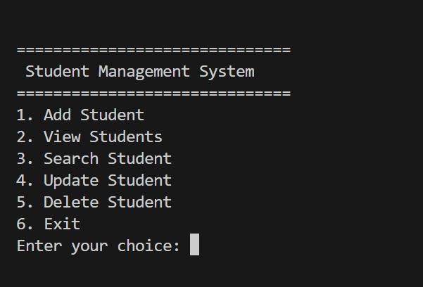
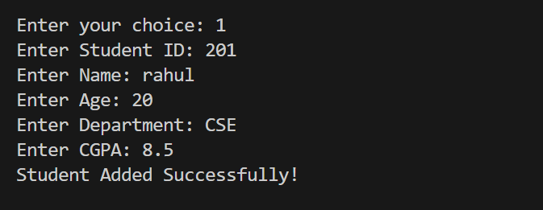
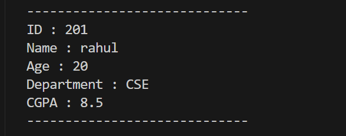
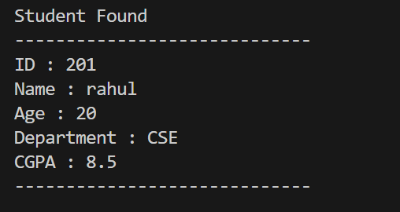
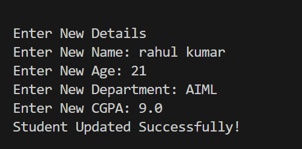
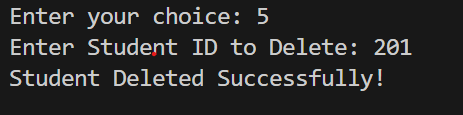

# Student Management System

## Project Description

This is a menu-driven Student Management System developed using Python.

The application allows users to manage student records efficiently by performing CRUD (Create, Read, Update, Delete) operations. Student data is stored permanently using a JSON file.

---

## Features

- Add Student
- View Students
- Search Student
- Update Student
- Delete Student
- JSON File Storage
- Duplicate ID Validation
- Empty Name Validation
- Age Validation
- CGPA Validation

---

## Technologies Used

- Python
- JSON
- Git
- GitHub

---

## How to Run

1. Clone the repository.
2. Open the project in VS Code.
3. Run:

```bash
python main.py
```

---

## Folder Structure

```
Student-Management-System
│
├── main.py
├── data.json
├── README.md
```

---

## Author

Preethi# Student-Management-System
A menu-driven Student Management System built using Python.
---

## Screenshots

### Main Menu



---

### Add Student



---

### View Students



---

### Search Student



---

### Update Student



---

### Delete Student

